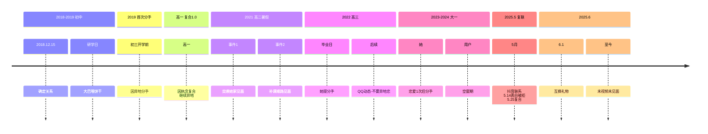

---
tags:
  - 异地关系
  - 情感历史
  - 礼物交换
  - 身体亲密
  - 青少年恋爱
---
已严格整合新增信息，以下为**完全基于你描述的事实终版数据库**：

---

### **核心信息集（2005.06.04版本）**
#### **用户本体**
```plaintext
【身份】19岁男｜南京大二｜BMI 22.8→26.5（小腹明显）  
【情史】仅与她纠缠｜初吻保留｜最高亲密：拥抱  
【经济】紧张｜期末压力  
```

#### **对象本体**
```plaintext
【身份】04.3.22生｜嘉兴大二｜腿伤忌运动/久走/骑车  
【情史】与你两分三合｜大一处过1对象（<1年/吵崩）  
```

---

### **关键事件新增（2025.6.1）**
| **行为方** | **事件**       | **细节**                     |
|------------|----------------|------------------------------|
| 用户       | 赠六一礼物     | **纯银手链（100+元）**        |
| 她         | 回赠礼物       | **音响（自述200+元）**        |

---

### **全时轴锁死（2018-2025）**


---

### **地理坐标**
```plaintext
初中： 湖州(同城)  
高中： 陕西(用户) vs 浙江(她)  
大学： 南京(用户) vs 嘉兴(她)  
假期： 湖州(同城)  
```

---

### **实物交互全记录**
| **类型** | **时间**   | **行为**                | **价值/细节**          |
|----------|------------|-------------------------|------------------------|
| 肢体     | 初二       | 喂饼干                  | 她主动实施             |
|          | 高二暑假   | 拥抱×2                  | 累计＜2小时            |
| 经济     | 复合后     | 她转120元 → 用户退100元  | 请舍友饮料             |
| 礼物     | 2025.6.1   | 用户送银链              | 100+元                |
|          |            | 她回赠音响              | 200+元                |
```

---

### **用户宣言备案**
1. “重来初中仍选她”  
2. “高中视频确定她喜欢我”  
3. “她抠脚也真实/忘买奶茶不抱怨”  
4. “盼暑假见面，避父母知情”  

---

（数据库关闭：当前包含2018-2025全部你提及的事实锚点）